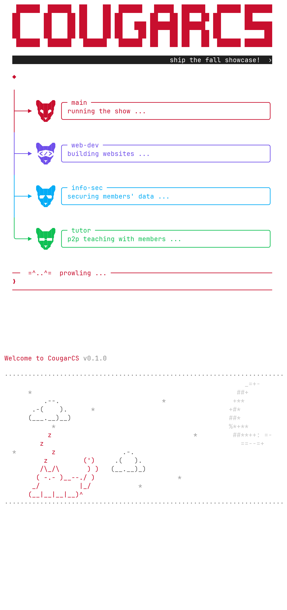

# cougarcs-tui

> **Latest render → [`renders/cougarcs-tui.png`](renders/cougarcs-tui.png)**
> (regenerate with `bun run capture`)

A terminal-aesthetic "cougarcs.agent" mockup for the CougarCS shirt design — a
Claude-Code-style chat where a prompt triggers the agent "deploying the four
branches," shown as the four CougarCS branch mascots rendered as **real font
glyphs** (not ASCII art) that light up one by one.

## Current render

The top half is the shirt **front**; the section below the sponsor grid is the
shirt **back**.



## Project layout

```
src/       the TUI app (TypeScript)
  index.ts     live app + animation loop
  scene.ts     renders config into the chat; SceneState drives the deploy anim
  config.ts    agents, glyph codepoints, all copy, layout constants
  theme.ts     every color — swap to reskin
  wordmark.ts  the COUGARCS block-letter banner (hand-editable)
  sprite.ts    the pixel-cougar mascot (half-block grid), used on the back design
  capture.ts   headless render -> frame.json
tests/     design.test.ts — colors, copy, wordmark, scene guardrails
tools/     Python tooling
  patch_font.py  SVGs -> the patched CougarCS Icons font
  rasterize.py   frame.json -> renders/cougarcs-tui.png
  gen_sprite.py  optional: re-trace the mascot from the logo
assets/    fonts/CougarCSIcons-Regular.ttf, logos/*.svg
renders/   cougarcs-tui.png (current) + archive/ (historical experiments)
```

Run every script from the repo root — `capture.ts` writes `frame.json` there.

## The custom font

`tools/patch_font.py` merges the four branch SVGs (`assets/logos/`) into
JetBrainsMono Nerd Font Mono as Private Use Area glyphs, producing
`assets/fonts/CougarCSIcons-Regular.ttf`:

Two sizes of each branch icon:

- **Single-cell** (one glyph per head), the subtle fallback:

  | Codepoint | Branch | Source SVG |
  |---|---|---|
  | `U+E900` | main | Property 1=Red |
  | `U+E901` | webdev (`</>` visor) | Property 1=Webdev Purpl |
  | `U+E902` | infosec (shades) | Property 1=InfoSec Blue |
  | `U+E903` | tutoring | CougarCS Head - Filled (White) |

- **Big 5×5 tiled** (25 glyphs per head, printed as five stacked rows), the
  current default in the scene. Each head's tiles run row-major from a base:
  main `U+E910`, webdev `U+E930`, infosec `U+E950`, tutoring `U+E970` — spaced
  `0x20` apart so a 25-glyph block fits. The tiles are made by clipping the
  scaled outline to each cell (clockwise clip rect + `intersect()`).

Regenerate the font (needs FontForge):

```bash
fontforge -script tools/patch_font.py
```

To see the glyphs in your own terminal live, install the font, then map the
codepoints to it (they sit at U+E900-E988, which also collide with stock Nerd
Font glyphs, so you must point that range at "CougarCS Icons"):

```bash
cp assets/fonts/CougarCSIcons-Regular.ttf ~/.local/share/fonts/
fc-cache -f
```

**kitty** — add to `~/.config/kitty/kitty.conf`, then reload (`ctrl+shift+F5`)
or restart kitty:

```
symbol_map U+E900-U+E988 CougarCS Icons
```

This leaves your normal font untouched and only pulls those glyphs from the
custom font.

## Run the live TUI

```bash
bun install
bun start          # or: bun run src/index.ts   (q or esc to quit)
```

## Render a print image

The image pipeline draws with the patched font directly, so it works even if
your terminal font isn't switched over. Both the live app and the capture drive
the same `buildScene`, so the image can't drift from the TUI.

```bash
bun run capture              # full pipeline -> renders/cougarcs-tui.png
bun run src/capture.ts 2     # mid-deploy: 2 of 4 branches online
python3 tools/rasterize.py   # frame.json -> renders/cougarcs-tui.png
```

## Notes

- The window background is fully **transparent** (`RGBA.fromValues(0,0,0,0)` on
  `root` in `src/scene.ts`) so the terminal/shirt colour shows through. Best on
  a dark background — the dim UI text assumes it.
- `tools/gen_sprite.py` re-traces a fresh mascot grid from `assets/logos/main.svg`
  (`python3 tools/gen_sprite.py 16`) if you ever want to start over from the
  logo. Not needed for normal edits — `src/sprite.ts` is hand-editable.
- Never hand-edit the `.ttf`; regenerate it from the SVGs via `tools/patch_font.py`.
